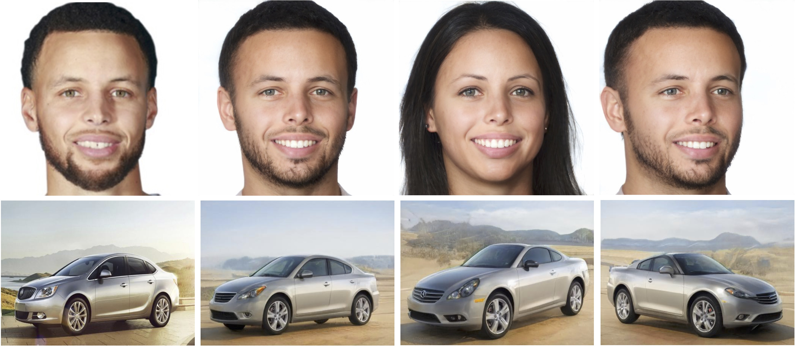
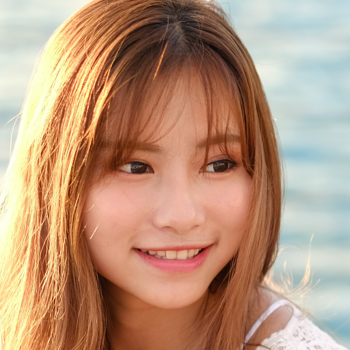
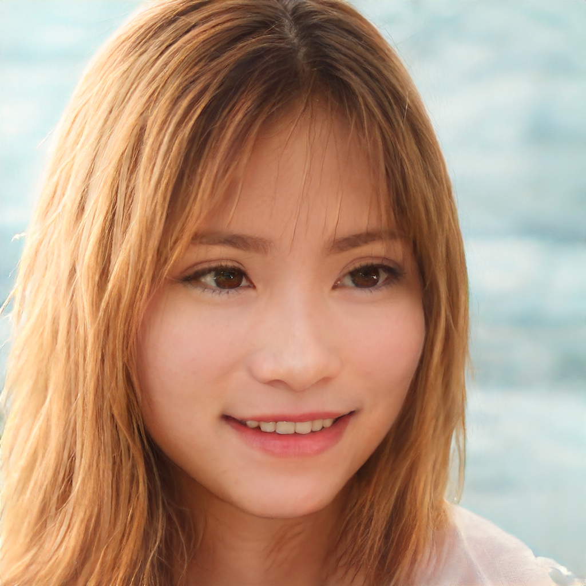
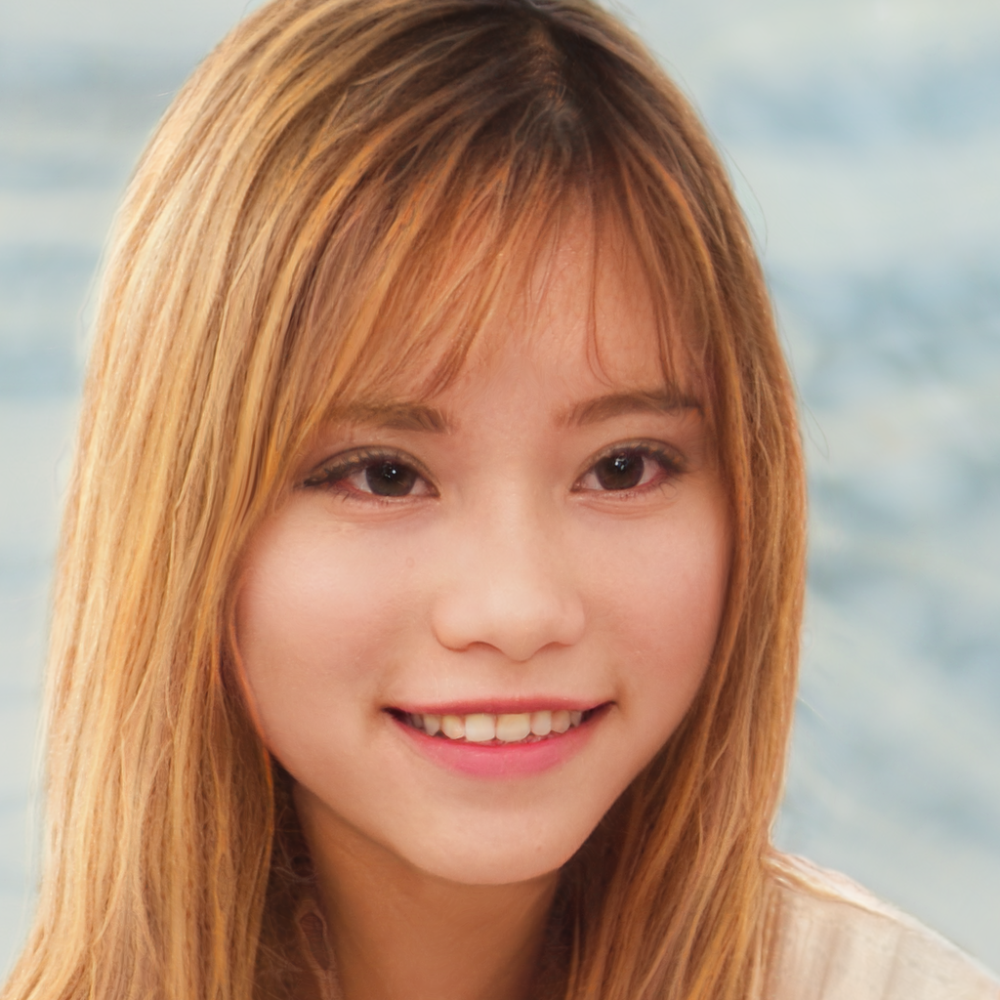

# Jittor version: Designing an Encoder for StyleGAN Image Manipulation (E4E)

**Designing an Encoder for StyleGAN Image Manipulation**  
Omer Tov, Yuval Alaluf, Yotam Nitzan, Or Patashnik, Daniel Cohen-Or. In [SIGGRAPH](https://arxiv.org/abs/2102.02766), 2021.

<p align="center">

</p>

The original page: [[Project Page]](https://github.com/omertov/encoder4editing)

## Notes
We implement the E4E encoder for facial images, both for StyleGAN2 and StyleGAN3. 

The official weight are converted jittor for StyleGAN2. The weights for StyleGAN3 are trained by ourselves. 

The Google Drive link: https://drive.google.com/drive/folders/1Vvf9pJ_NGj0oB7dBs8Be-Bfk0T08BEup?usp=sharing

## Quick start

Project real image into StyleGAN2 latent space : <br>
```
python inference_stylegan2.py --images_path ./imgs/input/69918.png --save_path ./imgs/output/69918_stylegan2.png --ckpt ./weights/e4e_ffhq_encode_stylegan2.pt
```

<p align="center">


</p>


Project real image into StyleGAN3 latent space: <br>

```
python inference_stylegan3.py --images_path ./imgs/input/69918.png --save_path ./imgs/output/69918_stylegan3.png --ckpt ./weights/e4e_ffhq_encode_stylegan3.pt
```
<p align="center">


</p>

## Acknowledgements

This repository borrows partially from the [original codes](https://github.com/omertov/encoder4editing) and [Sketch_GAN](https://github.com/maxminder/gansketching_reproducing) repository.


